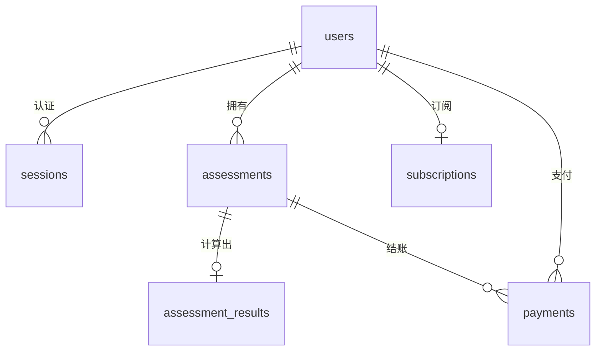

# BetterMe 健康测评系统 · 全栈挑战交付

**交付人：李宇晗**　·　2026-07-05

[](https://github.com/YH7916/BetterMe/actions/workflows/ci.yml)

一个健康测评订阅产品的核心后端 + 可用前端漏斗：分步录入 → 进度恢复 → 服务端算法 → 按订阅状态差异化返回（非会员脱敏 / 会员完整）→ 模拟 `/pay` 激活订阅。本文档即完整交付说明，无需翻阅其它文件。

---

## 一、在线体验

| | |
|---|---|
| 前端演示 | https://betterme.yesterhaze.codes |
| API 文档（Swagger）| https://api.betterme.yesterhaze.codes/api/v1/docs |
| 代码仓库 | https://github.com/YH7916/BetterMe |

**已支付测试会话**（作为 `Authorization: Bearer` 令牌传入，可直接对比付费前后差异并重放 `/pay`）：

```bash
API=https://api.betterme.yesterhaze.codes
TOKEN=seed-demo-token-0000000000000000000000000000000000000000000000000000000000000000
AID=ef0e9e76-0322-45af-89cc-f4b785c7b264

# 会员完整结果（含 daily_calorie_intake + target_date）
curl "$API/api/v1/assessments/$AID/result" -H "authorization: Bearer $TOKEN"

# /pay 重放（幂等，重复调用不重复扣费）
curl -X POST "$API/api/v1/pay" -H "authorization: Bearer $TOKEN" \
  -H "content-type: application/json" -d "{\"assessmentId\":\"$AID\"}"
```

## 二、本地运行

```bash
pnpm install
# 配置 apps/api/.env 的 DATABASE_URL / DIRECT_URL 指向 PostgreSQL，然后：
pnpm --filter @betterme/api exec prisma migrate deploy
pnpm --filter @betterme/api db:seed    # 预置已支付演示会话
pnpm dev                               # 前端 :5173 + 后端 :8787
pnpm test                              # 一键跑全部测试
```

## 三、技术栈

后端 **Hono + Node 22 + TypeScript**，**Prisma + PostgreSQL（Supabase）**；前端 **Vite + React**；测试 **Vitest + Playwright**；契约 **Zod**（前后端类型 + OpenAPI 单一来源）；CI **GitHub Actions**；部署 **Railway + Cloudflare Pages**。

## 四、核心设计

- **分层架构**：routes → middlewares → controllers → services → repositories，业务逻辑不依赖框架/ORM，可单测。
- **原始与派生分表**：`assessments`（用户录入）和 `assessment_results`（算法结果）分开，结果带 `algorithm_version`，算法升级可重算而不污染原始数据。
- **能力令牌鉴权**：`sessions` 表存不可猜、可过期的 token，`Bearer` 传递；不拿资源 ID 当凭证，令牌永不出现在响应体。
- **脱敏靠字段物理缺失**：非会员响应里 `daily_calorie_intake` / `target_date` 不存在，而非仅打一个标志。
- **支付幂等闭环**：同一事务内写支付记录 + 激活订阅，幂等键防重复扣费。

## 五、API 接口

统一约定：业务接口前缀 `/api/v1`；鉴权用 `Authorization: Bearer <token>`；统一错误体 `{ "error": { "code", "message" }, "request_id" }`，校验失败额外带 `error.fields` 列出**全部**非法字段。

| 方法 | 路径 | 鉴权 | 说明 |
|---|---|---|---|
| POST | `/api/v1/assessments` | — | 创建会话 + 测评，返回 token |
| GET | `/api/v1/assessments/:id` | Bearer | 进度恢复 |
| PATCH | `/api/v1/assessments/:id` | Bearer | 分步增量保存 |
| POST | `/api/v1/assessments/:id/submit` | Bearer | 计算并持久化结果 |
| GET | `/api/v1/assessments/:id/result` | Bearer | 结果（脱敏 / 完整）|
| DELETE | `/api/v1/assessments/:id` | Bearer | 删除测评及派生数据（GDPR）|
| POST | `/api/v1/pay` | Bearer | 模拟支付，激活订阅 |

完整请求/响应可在线调试：https://api.betterme.yesterhaze.codes/api/v1/docs

## 六、数据库 Schema



**六张表**
- `users` — 匿名用户，仅 id + 时间戳，无账号 PII。
- `sessions` — 能力令牌（`token` 唯一、`expires_at` 可过期），Bearer 鉴权来源。
- `assessments` — 分步录入，字段可空以支持增量保存；`current_step` 支撑进度恢复。
- `assessment_results` — 算法派生结果，与录入分表，带 `algorithm_version`。
- `subscriptions` — 订阅，建号即建、默认 `inactive`，避免结果查询出现 nullable join。
- `payments` — 模拟支付记录，`idempotency_key` / `provider_ref` 唯一。

**建模要点**：健康数值用 `Decimal`（非 float）保精度；`assessment_results.assessment_id`、`subscriptions.user_id` 唯一约束保证 1:1；`sessions.token`、`payments.idempotency_key` 唯一索引；`sessions.user_id`、`assessments.user_id`、`payments` 建索引；支付创建与订阅激活在同一事务内完成。

## 七、测试与质量

- **一键运行**：`pnpm test`（shared 36 + web 36 + api 34 = **106 项**）
- **覆盖**：算法边界（极端/缺失/非法输入）、分步保存与恢复（中断/乱序/并发/不回退）、鉴权差异化（脱敏 vs 完整）、`/pay` 后脱敏→完整端到端。
- **未覆盖**：真实支付网关、压测（超出范围，`/pay` 为模拟回调）。
- **CI** 每次跑 lint / typecheck / build / 测试 / 核心算法覆盖率门禁。

## 八、AI 使用复盘

1. **借助 skill 先规划**：用 superpowers 的 brainstorming / 写计划等 skill，先把需求和边界聊清楚，产出一份实现计划，**先定代码结构再动手**（分层、模块边界、数据契约）。
2. **测试驱动开发（TDD）**：核心逻辑先写测试再写实现，红→绿→重构；让 AI 补边界用例。
3. **验收 AI 产出**：AI 写的东西逐段过一遍，不对就改（比如否决它给的 `deleteMany` 清库式测试重置，改用独立 `test` schema 隔离，避免抹掉演示数据）。
4. **再打磨细节**：结构层面的优化，比如**路由与实现分离**（routes 只声明方法/路径/中间件，业务下沉到 service/repository）、**前后端分离**（monorepo + shared 包做单一契约）。
5. **先后端、后前端**，力求各模块完全解耦。
6. **部署走 CLI**：`railway up` 部署 API、`wrangler pages deploy` 部署前端，全流程命令行完成。
