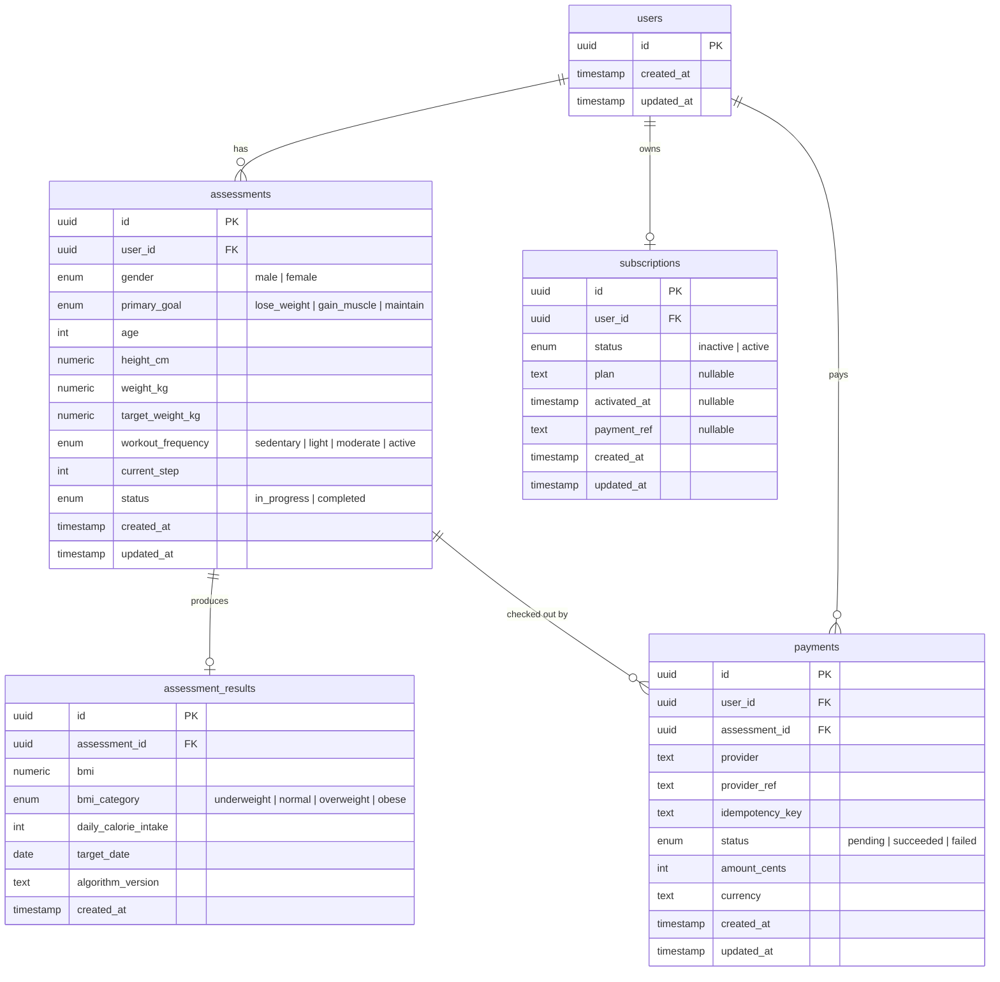

# Database Schema — BetterMe 健康测评

## ER Diagram

---

## Relationships

| Relationship | Cardinality | Notes |
|---|---|---|
| users → assessments | 1 : many | A user can start multiple assessments (abandoned sessions). Each assessment is independent. |
| assessments → assessment_results | 1 : 0..1 | A result only exists after `POST /submit` succeeds. The `assessment_id` FK is `UNIQUE`, enforcing at most one result per assessment. |
| users → subscriptions | 1 : 0..1 | Every user gets a `subscriptions` row on creation (status `inactive`). The first `POST /pay` updates it to `active`; repeated calls are idempotent. `user_id` FK is `UNIQUE`. |
| users / assessments → payments | many : 1 | A mock checkout attempt is recorded before subscription activation. `idempotency_key` and `provider_ref` are unique so repeated callbacks do not create duplicate charges. |

---

## Field Rationale

### users

Intentionally minimal. The system uses anonymous sessions — there is no email, password, or display name. `id` is a server-generated UUID returned to the frontend for subsequent requests. `created_at` / `updated_at` are standard audit timestamps managed by Prisma.

### assessments

Assessment data is stored incrementally via `PATCH` requests. Fields are nullable so the row can be created (and owned) before any data is entered. `current_step` (int) enables reliable progress recovery: the frontend can resume at exactly the right step by reading this value. `status` tracks whether the submission algorithm has been run; it gates the result endpoint's 404 vs 200 behaviour. Storing raw inputs separately from computed outputs (`assessment_results`) means the algorithm can be re-run with a different version without modifying the user's data.

### assessment_results

Stores computed outputs only — no raw user inputs. The `algorithm_version` field (`"v1"`) allows future algorithm changes to be tracked; old results remain queryable with their original version. `bmi` is stored as `numeric` (Prisma `Decimal`) for precision. `target_date` is stored as a `DATE` column (no time component) since precision beyond day-of-week is meaningless at 0.5 kg/week granularity. The 1:1 `UNIQUE` constraint on `assessment_id` means upsert semantics are available: submit can be called again (e.g. after a data correction) and the result is recomputed in place.

### subscriptions

One row per user, created at user creation with `status = inactive`. This avoids a nullable join in the result query: `subscriptionRepo.findByUser()` always returns a row and the service just checks `status === 'active'`. Nullable fields (`plan`, `activated_at`, `payment_ref`) are set by the first `/pay` activation and kept stable on repeated demo unlock calls. They can be extended for real payment provider data (e.g. Stripe `payment_intent_id`) without a migration.

### payments

Records the simulated payment event with production-like semantics. The current provider is `mock`, but the table mirrors real checkout/webhook data: stable provider reference, caller-provided or server-derived idempotency key, amount in minor units, currency, and status. Subscription activation is performed in the same transaction as payment creation, so a successful mock payment cannot be half-applied. Repeated `/pay` calls return the existing succeeded payment instead of creating a second charge.

---

## Indexes

| Table | Column | Type | Reason |
|---|---|---|---|
| assessments | user_id | Non-unique index (`@@index`) | `requireOwnership` middleware looks up an assessment by `id` and then verifies `userId` — this covers the FK join for ownership checks |
| assessment_results | assessment_id | Unique index (from `@unique`) | Enforces 1:1 constraint and makes `findUnique({ where: { assessmentId } })` efficient |
| subscriptions | user_id | Unique index (from `@unique`) | Enforces 1:1 constraint and makes `findUnique({ where: { userId } })` efficient |
| payments | idempotency_key | Unique index | Prevents duplicate charges for retried checkout callbacks |
| payments | provider_ref | Unique index | Mirrors real provider event/payment IDs for replay-safe processing |
| payments | user_id / assessment_id | Non-unique indexes | Supports payment history lookup by user or assessment |
